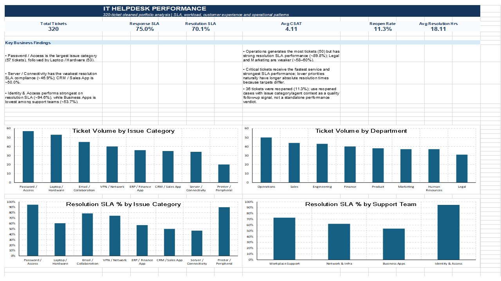

# IT Helpdesk Performance Analysis

## Overview

This project analyzes IT helpdesk ticket data in Excel to understand support demand, SLA performance, team performance, customer satisfaction, and recurring operational issues.

The analysis focuses on turning ticket-level data into actionable insights that could help an IT support team identify service bottlenecks and areas requiring further investigation.

## Tools Used

- Microsoft Excel
- PivotTables
- PivotCharts
- Excel formulas
- Conditional formatting
- KPI dashboard

## Analysis Workflow

The project follows a structured Excel-based analysis workflow:

1. Reviewed and cleaned the raw helpdesk ticket data.
2. Checked for duplicate ticket records and data-quality issues.
3. Standardized department and ticket information.
4. Calculated response and resolution times.
5. Compared ticket performance against SLA targets.
6. Analyzed ticket volume, SLA compliance, team performance, reopen rates, and CSAT.
7. Created PivotTables and summary metrics for operational analysis.
8. Built an Excel dashboard to present the key KPIs and findings.

## Key KPIs

The final cleaned dataset contains **320 unique tickets** across **8 departments**.

- **Response SLA Compliance:** 75.0%
- **Resolution SLA Compliance:** ~70.1%
- **Average CSAT:** ~4.11 / 5

The dashboard also tracks ticket volume and SLA performance across teams, departments, priorities, and issue categories.

## Key Findings

- **Password / Access** was the highest-volume ticket category, indicating that access-related issues represented a significant portion of helpdesk demand.
- **Laptop / Hardware** was also one of the largest sources of support tickets.
- Overall **Response SLA compliance was 75%**, while **Resolution SLA compliance was lower at approximately 70.1%**, suggesting that completing tickets within SLA was a greater challenge than providing the initial response.
- **Business Apps** showed comparatively weak Resolution SLA performance, suggesting that application-related tickets may require further investigation into escalation or resolution processes.
- Certain application and infrastructure-related areas, including **Server / Connectivity** and **CRM / Sales App**, showed weaker resolution performance and could be investigated for recurring bottlenecks.
- Reopen rate and CSAT were also reviewed alongside SLA performance to avoid evaluating service quality using SLA compliance alone.
- Team-level results were treated as operational indicators rather than direct measures of individual agent performance.

## Business Recommendations

Based on the analysis, the helpdesk team could:

- Investigate recurring Password / Access and Hardware issues to identify opportunities for self-service or preventive support.
- Review the resolution workflow for departments and issue categories with weaker Resolution SLA compliance.
- Examine whether escalation paths, dependencies, or ticket complexity are contributing to longer resolution times.
- Track SLA performance together with reopen rate and CSAT rather than relying on a single service metric.
- Use the dashboard for periodic monitoring of ticket demand and operational performance.

## Dashboard

## Repository Contents

- `IT_Helpdesk_Portfolio.xlsx` — complete Excel analysis, including cleaned data, calculations, PivotTables, dashboard, and findings.
- `dashboard.png` — dashboard preview.
- `README.md` — project overview and key findings.

## Note

The findings in this project are based on the provided helpdesk dataset. Team and department-level metrics are intended to highlight areas for further operational investigation and should not be interpreted as direct measures of individual employee performance.
